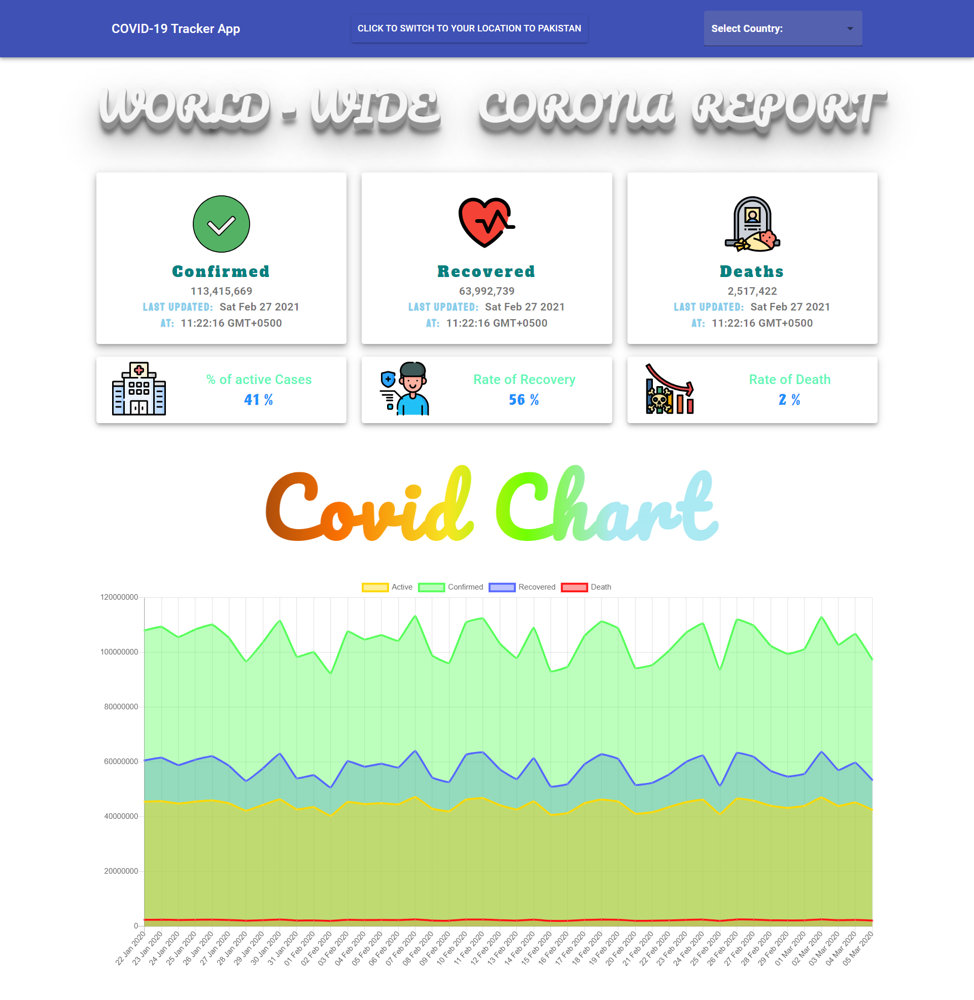

# 👨‍💻 Covid Tracker App.
## 📽 A project based on Panacloud React Bootcamp.

### ⚒ Project Demo:
####  For Project Demo Follow the Link: http://locate-covid.surge.sh/

### 🕵️‍♂️ Project Details:
####  This project is based on primarily on React as well as uses other libraries too!

### ⚙ Technical Details:
#### In this project React is used for the project. Other Libraries used includes Material-UI, ChartJS, LoaderCss, React-ChartJS-2, React-Country-Flag, React-Countup, React-Geolocated, React-Loaders, React-Select-Country, React-Spinner and React-Toastify. 

### 🤹‍♂️ Skill:
&nbsp;&nbsp;&nbsp;&nbsp;
&nbsp;&nbsp;&nbsp;&nbsp;

### ✔ Contributers:

  <a href="https://github.com/faraasat">
    &nbsp&nbsp&nbsp&nbsp&nbsp&nbsp&nbsp&nbsp&nbsp&nbsp&nbsp&nbsp
  </a>

### 📷 Project UI:

  <a href="http://locate-covid.surge.sh/">
    &nbsp&nbsp&nbsp&nbsp&nbsp&nbsp&nbsp&nbsp&nbsp&nbsp&nbsp&nbsp
  </a>

